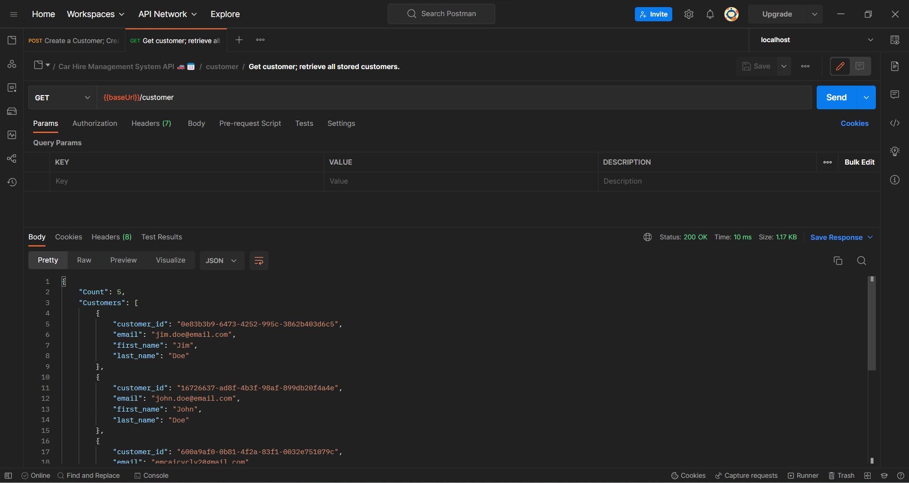
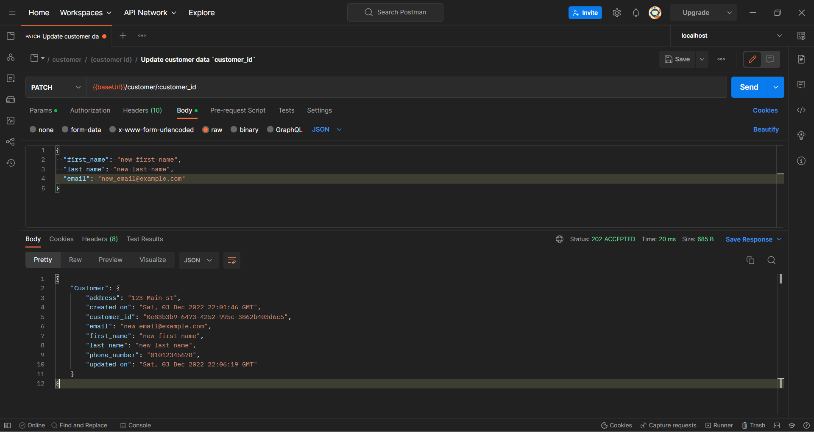

# car-hire-management-system-api
Car Hire Management System API. A Python microservice implemented using Flask microframework that is connected to MySQL DB.


## Entity Relationship Diagram (ERD)

<br>
<p align="center">
<br>
<b>Entity Relationship Diagram (ERD)</b>
</p>


> [View on Lucidchart](https://lucid.app/lucidchart/2ba497fa-7649-469d-821f-cc5862c23d5c/edit?invitationId=inv_932716e3-95cb-4c1c-8436-1f4825429d27)


---
## Workflow

- Clone the repository
    ```sh
    $ git clone https://github.com/kfrawee/car-hire-management-system-api.git
    ```
- Navigate to the directory:
    ```sh
    $ cd .\car-hire-management-system-api\
    ```
- Create a Virtual environment and activate it:
    ```sh
    $ python -m venv .venv
    ```
- Install the required dependencies:
    ```sh
    (.venv) $ pip install -r requirements.txt
    ```
- Run the flask server:
    ```sh
    (.venv) $ python api.py
    ```
- Navigate to the Swagger file (OpenAPI Specification) and load the file to Postman:

    > Below are sample requests and responses using Postman with the attached swagger file.

    <br>
    <p align="center">
    <br>
    <b>Create Customer</b>
    </p>

    <br>
    <p align="center">
    <br>
    <b>Get Customers</b>
    </p>

    <br>
    <p align="center">
    <br>
    <b>Get Customer</b>
    </p>

    <br>
    <p align="center">
    <br>
    <b>Update Customer</b>
    </p>

    <br>
    <p align="center">
    <br>
    <b>Delete Customer</b>
    </p>
---